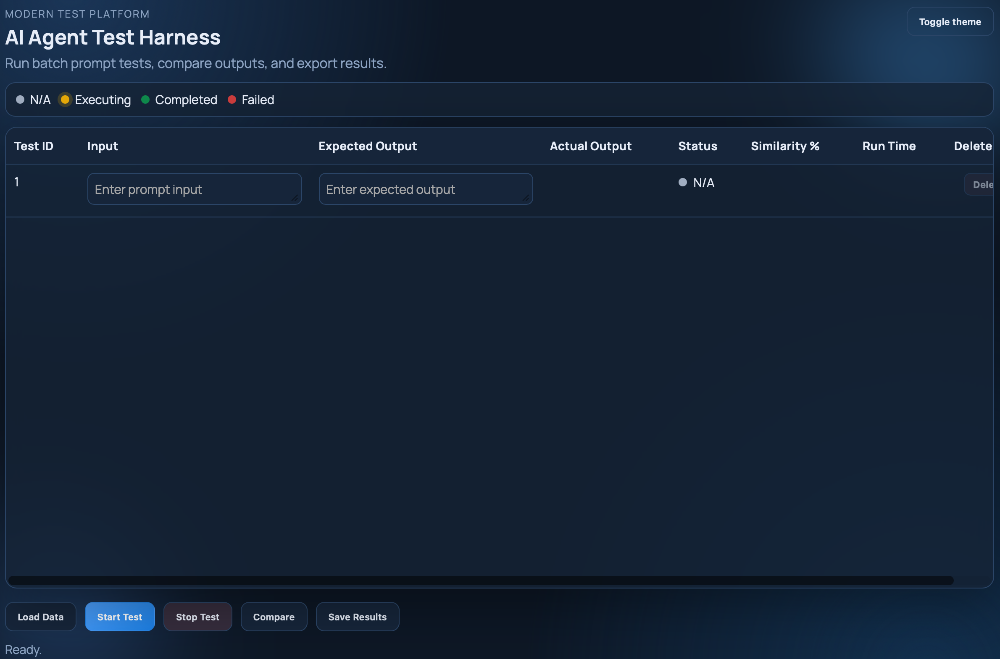

# AI Agent Test Harness

Local Node.js single-page web app to run prompt tests against an AI agent endpoint, compare against expected outputs, and export results.

## Screenshot


## Features
- Single-page adaptive UI with light/dark mode.
- Scrollable 8-column test table:
  - Select (multi-row)
  - Test ID
  - Input
  - Expected Output
  - Actual Output
  - Status (N/A, Executing, Completed, Failed) with icon + tooltip
  - Similarity %
  - Run Time
- Buttons:
  - Load Tests
  - Start Tests (max 10 parallel calls)
  - Stop Ongoing Tests (abort in-flight calls)
  - Compare All
  - Save Results (.xls export)
  - Remove Selected (bulk delete selected rows)
- Status legend.
- Summary display with overall status + counts (success/failed/ongoing) + average similarity.

## Editable grid and loading behavior
- The `Input` and `Expected Output` columns are editable directly in the table.
- A trailing blank manual row is always available for typing a new test.
- `Load Tests` appends loaded tests after manual entries.
- A new file load replaces previously loaded rows from older file loads, while keeping manual entries.
- Select rows in the first column and click `Remove Selected` for bulk delete.

## Input file format
You can load `.json`, `.csv`, `.txt`, or `.xls` (CSV-style content):

- JSON: array of objects with `input` and `expected`
```json
[
  { "input": "Prompt 1", "expected": "Ideal output 1" },
  { "input": "Prompt 2", "expected": "Ideal output 2" }
]
```

- CSV/TXT: one test per line, `input,expected`
```text
What is 2+2?,4
What is capital of France?,Paris
```

- XLS (upload sample): use [sample-input.xls](/Users/andrewong/Documents/Codex/sample-input.xls)

## Integration config
Set environment variables before starting:

- `AGENT_RUN_URL`: POST endpoint for test execution. Request body:
```json
{ "input": "..." }
```

- `AGENT_COMPARE_URL`: POST endpoint for similarity scoring. Request body:
```json
{ "expected": "...", "actual": "..." }
```

Optional auth:
- `AGENT_AUTH_HEADER` (example: `Authorization`)
- `AGENT_AUTH_TOKEN` (example: `Bearer ...`)

The app accepts common response shapes for run output (`output`, `result`, `response`, `text`, `answer`) and compare score (`score`, `similarity`, `percent`, `match`).

## Run locally
```bash
npm install
AGENT_RUN_URL="https://your-agent/run" AGENT_COMPARE_URL="https://your-agent/compare" npm start
```

Open `http://localhost:3000`.

## Run automated test utility
```bash
npm run test:harness
```

This runs major feature checks from:
- `tests/run-tests.js`
- `tests/TEST_CASES.md`

## macOS startup instructions
1. Save these files in one folder (project root):
   - `package.json`
   - `package-lock.json`
   - `server.js`
   - `public/index.html`
   - `public/styles.css`
   - `public/app.js`
   - `sample-input.xls`
   - `tests/TEST_CASES.md`
   - `tests/run-tests.js`
   - `README.md`
2. In Terminal, go to the project folder:
```bash
cd /path/to/agent-test-harness
```
3. Install dependencies:
```bash
npm install
```
4. Start the site:
```bash
AGENT_RUN_URL="https://your-agent/run" AGENT_COMPARE_URL="https://your-agent/compare" npm start
```
5. Open in browser:
   - `http://localhost:3000`
